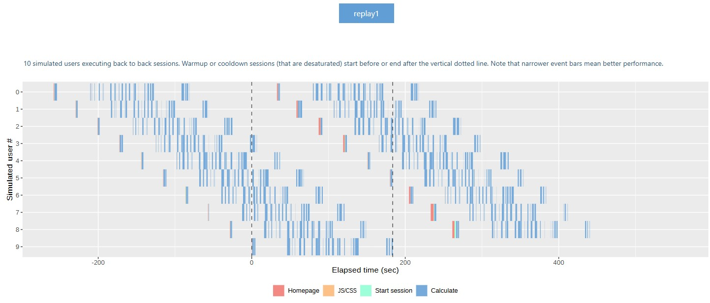
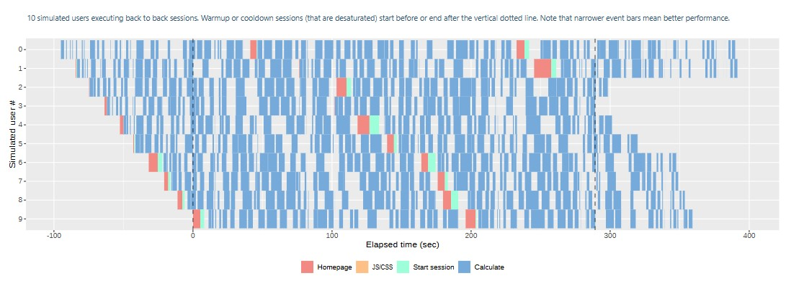
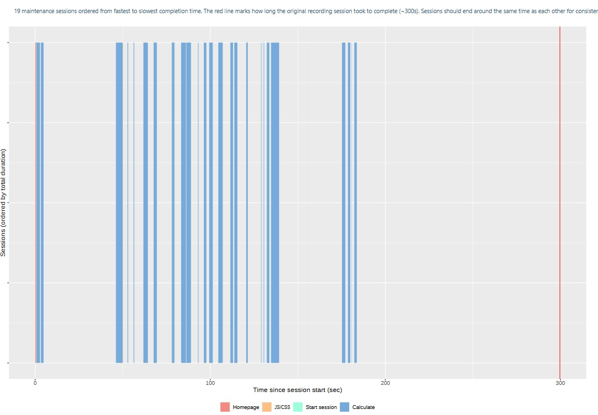
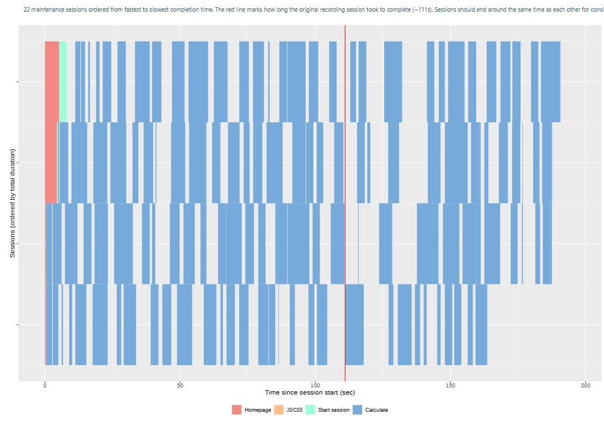
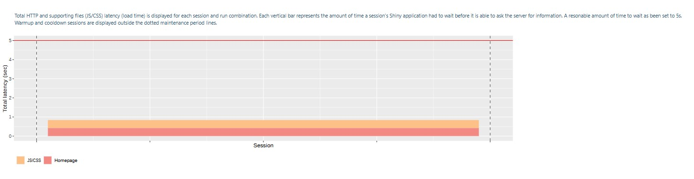
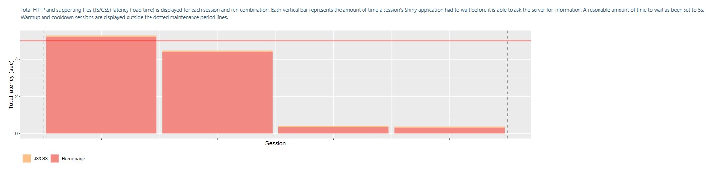
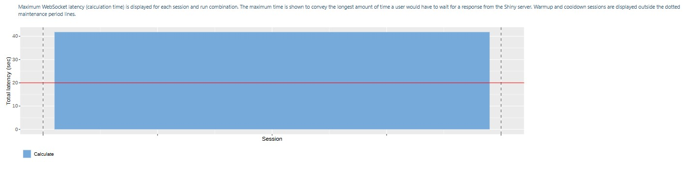
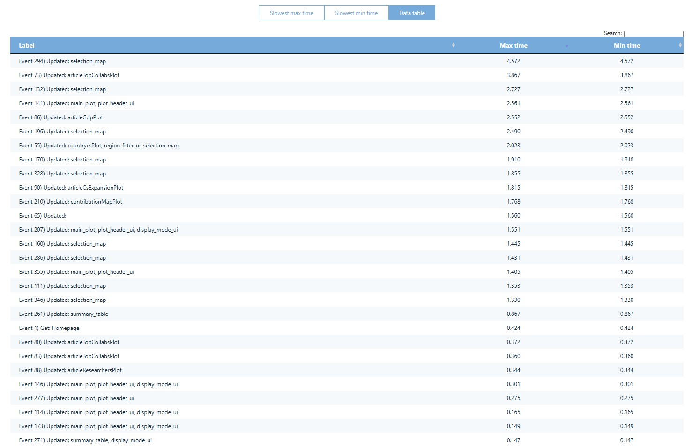
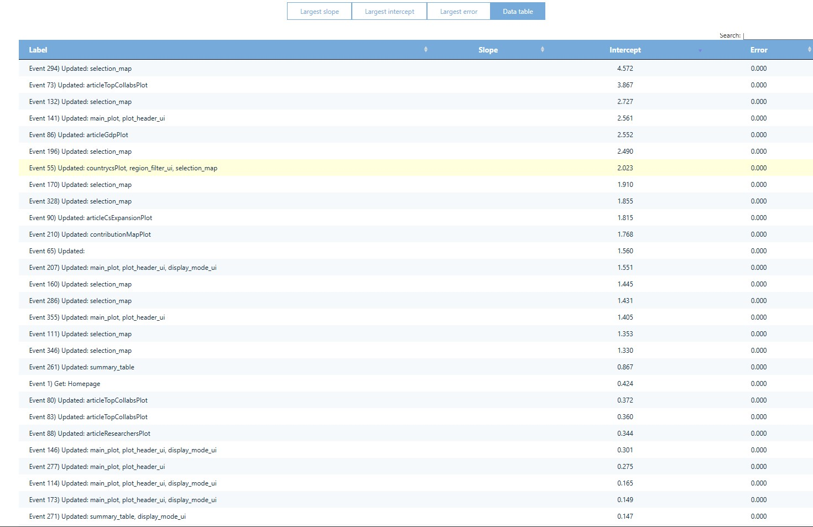

# duckplyr shinyloadtest results:

## Sessions

Sessions with current duckdb (best, rectangles are narrower)

Sessions with dplyr (worst)

### Key Observations:
1. **User Wait Times**:
   - The colored rectangles (especially the wide ones) show where users are waiting for the app to respond.
   - If the plot is mostly bright (colored), it means users spend a lot of time waiting, which indicates slower performance.

2. **Performance Issues**:
   - The **"Calculation"** events appears to have relatively wide rectangles, suggesting this step might be slow. This is a potential bottleneck, but expected as it involves **massive data processing**.
   - The **"Start session"** and **"Homepage"** events seem narrower, meaning they perform better. This means the app loads quickly and starts sessions efficiently.

3. **Overall App Speed**:
   - The test simulates 10 users using the app back-to-back. If the colored bars are consistently wide across multiple workers (rows), the app may struggle under load. This does not seem to be the case.
   - The gray background (where the app waits for the user) is minimal, meaning **most of the time is spent processing** requests rather than idling.

## Session duration

Duckdb (best, sessions end before the red line)

dplyr (worst, some sessions end after the red line)

### **Interpretation of Session Duration Results**  

This graph shows **19 test sessions** (simulated users) ordered from fastest (top) to slowest (bottom). The **red line** marks the original recording session's duration (~300 seconds). Ideally, all sessions should finish around the same time.  

#### **Key Observations:**  

1. **Wide Variation in Session Times**  
   - Some sessions finish much faster than the red line (~300s).  
     - Some users get fast responses.  

2. **Bottlenecks in Key Events**  
   - **"Calculate"** appears to be the slowest step (widest bars), meaning it’s likely the main performance bottleneck.  
   - **"Start session"** and **"Homepage"** are relatively quick (narrow bars).  

# latency and websocket

Latency with duckdb (best, below 5 seconds)

Latency with dplyr (worst, above 5 seconds)

Latency and Websocket with duckdb

### **Interpretation of Latency Results**  

These graphs show two key types of delays (latency) in your Shiny app:  
1. **Total HTTP Latency** – Time users wait for the app to load static files (Homepage, JS/CSS).  
2. **Maximum WebSocket Latency** – Time users wait for calculations to complete (R processing time).  

---

### **1. Total HTTP Latency (Static File Loading Time)**  
- **What’s Measured?**  
  - How long users wait before seeing anything in their browser (Homepage, JS/CSS files).  
  - **Ideal:** Should be **under 5 seconds** (reasonable benchmark).  

---

### **2. Maximum WebSocket Latency (Calculation Time)**  
- **What’s Measured?**  
  - The **longest delay** a user experiences while waiting for R to compute results under stress.  
  - Represents **"Calculate" step performance** (R code efficiency).  

--- 

# Event duration and concurrency

### **Interpretation of Event Duration & Concurrency Results**

These tables help identify **which specific events are slow** and **how they behave under load**. Here’s a breakdown:

---

### **1. Event Duration Analysis (First Table)**
**What’s Measured?**  
- How long each event (interactive element) takes to execute.  
- **Max time** = Worst-case delay, **Min time** = Best-case performance.  

#### **Key Observations:**  
- **Slowest Events (Bottlenecks):**  
  - `selection_map`  updates (e.g., **4.572s max**, 3.867s min)  
  - `article_Top_Collabborators` (up to **3.867s**)  
  - `country_Plot` & `region_filter` updates (~**2.023s**)  

- **Fastest Events:**  
  - Homepage load (**0.424s**)  
  - Summary table updates (~**0.147s**)  
---

### **2. Event Concurrency Analysis (Second Table)**  
**What’s Measured?**  
- How event duration changes under load (**Slope** = sensitivity to traffic; higher = worse scalability).  

#### **Key Observations:**  
- **Worst Scalability:**  
  - `selection_map` (Slope = **4.572**)  
  - `article_TopCollaboratoes` (Slope = **3.867**)  
- **Best Scalability:**  
  - Homepage (Slope = **0.424**)  
  - Summary table (Slope = **0.147**)  
---
